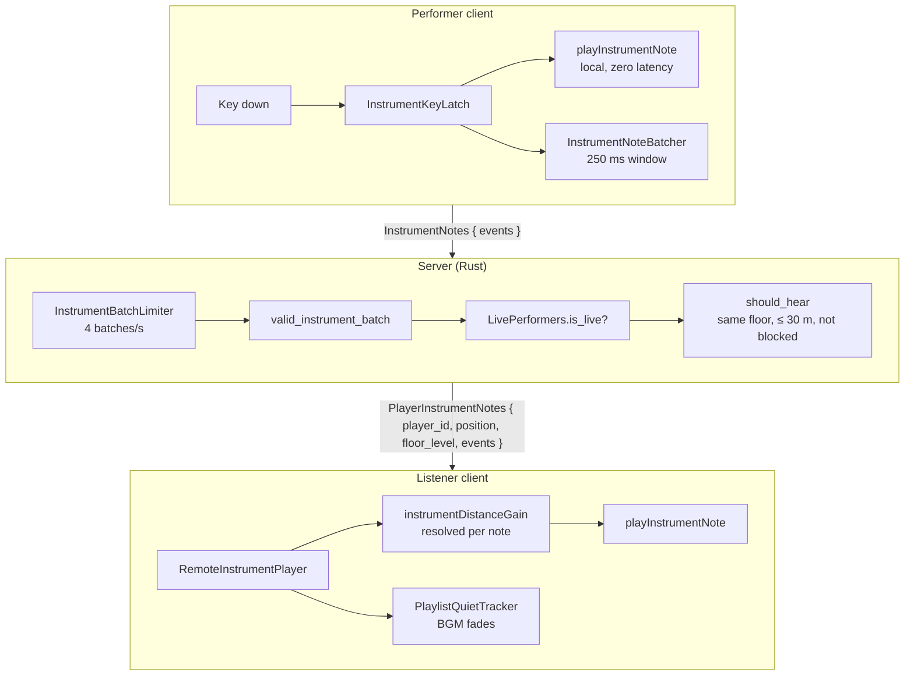

<div align="center">

# Bardkit

**Play a lute in the browser and let the players around you hear it.**

[](https://github.com/darkdarkcocoa/bardkit/actions/workflows/ci.yml)
[](#license)
[](packages/core)
[](packages/ui-svelte)
[](packages/server-rust)
[](https://www.npmjs.com/package/bardkit-core)
[](https://www.npmjs.com/package/bardkit-ui-svelte)
[](https://crates.io/crates/bardkit)

**[▶ Live demo](https://darkdarkcocoa.github.io/bardkit/)** ·
[Integration guide](docs/INTEGRATION.md) ·
[Architecture](docs/ARCHITECTURE.md)


</div>

Bardkit lets the players in your multiplayer game pick up an instrument and
play for whoever happens to be standing nearby. Open the panel, press a key,
and the note rings out for you at once. A moment later everyone around you
hears the same phrase, a little quieter the further away they are, while the
background music politely steps aside. It is happiest in an MMO plaza, but it
works anywhere players share a space.

The reference skin is a lute, because that is what a bard would carry. The
header text and artwork are props; the notes, the colours and the voice live
in the source, ready for you to reshape.

## What makes it nice

- **No audio files, ever.** Every note is a plucked string synthesized with
  the Web Audio API the first time it is played, then cached. The whole
  instrument is a few kilobytes of code, and changing the skin never means
  shipping 22 new recordings.
- **You never wait for the server, and nobody hears your rhythm mangled.**
  Your own notes sound on key-down. Everyone else receives them one network
  hop later, in a 250 ms batch that carries each note's timing, so the phrase
  arrives the way you played it.
- **The server keeps its scepticism.** A token bucket per connection, a strict
  batch rule (at most 16 notes, a 250 ms window, offsets in order) and a
  registry of who is actually performing mean floods and forged batches never
  reach a listener.
- **It sounds like it is in the world.** Gain is worked out per note from
  where the performer was standing, so if you walk away mid-song the tail of
  the phrase fades with you.
- **The background music knows when to hush.** A quiet tracker lowers the
  playlist while the panel is open or notes are being heard, and brings it
  back ten seconds after the last one, so a dramatic pause does not hand the
  speakers back too early.
- **Both halves agree on the numbers, or the build tells you.** The batch
  window, note cap, radius and rate limit sit in one `limits.json`. TypeScript
  imports it; the Rust crate's tests check their constants against it. Change
  one side alone and the other side fails.

## How it works



The house rule: the client never waits for the server, and the server never
takes the client's word for anything. [docs/ARCHITECTURE.md](docs/ARCHITECTURE.md)
has the numbers behind every box.

## Packages

| Package                                   | Stack                      | What it holds                                                                                 |
| ----------------------------------------- | -------------------------- | --------------------------------------------------------------------------------------------- |
| [`bardkit-core`](packages/core)           | TypeScript, framework-free | Note table, synth and voice pool, key latch and batcher, wire types, remote replay, BGM yield |
| [`bardkit-ui-svelte`](packages/ui-svelte) | Svelte 5                   | `InstrumentPanel` HUD driven by props, plus an optional visibility store                      |
| [`bardkit`](packages/server-rust)         | Rust crate                 | Wire types, batch validation, token bucket, performer registry, listener hearing rule         |
| [`examples/demo`](examples/demo)          | Vite + Svelte              | Loopback stage: validates each batch and replays it as a nearby performer                     |

Take what you need. The core is framework-free, so a React or Vue game can
keep the audio and networking and draw its own panel. A server in another
language only has to port three rules from `core`, where the batch check is
mirrored as `isValidInstrumentBatch`.

## Install

```bash
npm install bardkit-core bardkit-ui-svelte
```

```toml
[dependencies]
bardkit = "0.1"
```

## Try it locally

```bash
npm install
npm run dev        # http://localhost:5178
```

Click **Play instrument** and play with `Q`–`I` (high), `A`–`J` (middle) and
`Z`–`M` (low). Every 250 ms batch is validated, delayed like a real network
hop and played back as a second performer standing at whatever distance you
pick, so you hear yourself the way a neighbour would.

## Use it in your game

**Mount the panel** and send each finished batch through your transport:

```svelte
<script lang="ts">
  import { InstrumentPanel } from 'bardkit-ui-svelte'
  import { toWireEvents } from 'bardkit-core'
  let open = $state(false)
</script>

<InstrumentPanel
  {open}
  performerId={myPlayerId}
  onNotes={(events) =>
    socket.send({ InstrumentNotes: { events: toWireEvents(events) } })}
  onStop={() => {
    socket.send('StopInteraction')
    open = false
  }}
/>
```

**Replay other performers** with gain resolved from where they were:

```ts
import {
  RemoteInstrumentPlayer,
  instrumentDistanceGain,
  PlaylistQuietTracker,
} from 'bardkit-core'

const remote = new RemoteInstrumentPlayer()
const quiet = new PlaylistQuietTracker({
  onEnter: () => bgm.fadeOut(),
  onLeave: () => bgm.resume(),
})

function onPlayerInstrumentNotes(msg) {
  remote.play(
    msg.player_id,
    msg.events,
    () =>
      msg.floor_level === myFloor()
        ? instrumentDistanceGain(distanceTo(msg.position))
        : 0,
    () => quiet.hold('heard')
  )
}
```

**Validate on the server** before relaying to whoever should hear it:

```rust
use bardkit::{valid_instrument_batch, should_hear, InstrumentBatchLimiter, LivePerformers};

if limiter.allow() && valid_instrument_batch(&events) && performers.is_live(&player_id) {
    let listeners = players.iter().filter(|l| {
        should_hear(&l.id, &player_id, l.floor == floor, l.distance_to(position), l.blocks(&player_id))
    });
    // encode once, send PlayerInstrumentNotes { player_id, position, floor_level, events } to each
}
```

The full walkthrough, including the start handshake, what ends a performance
and the lock discipline around the registry, is in
[docs/INTEGRATION.md](docs/INTEGRATION.md).

## What the kit decides, and what your game decides

Bardkit decides how music is made and moved. Your game decides who gets to
play and what interrupts them.

| Kit                                                         | Your game                                                |
| ----------------------------------------------------------- | -------------------------------------------------------- |
| Note table (C3–C6 naturals, A4 = 440 Hz), key map           | Who may perform (item, class, zone)                      |
| Synth voice, 4-voice pool, distance curve                   | Player positions, floors, world wrap                     |
| 250 ms batching, 16-note cap, offset rules                  | Transport (WebSocket, ENet, …) and message envelope      |
| Batch validation and 4/s token bucket                       | Relay to listeners, block lists, area of interest        |
| Remote replay with per-note gain resolution                 | What ends a performance (move, hit, trade, equip, death) |
| Playlist-quiet tracker (panel open, heard notes, 10 s hold) | The BGM player that fades out and back                   |
| Panel UI, keyboard capture, Escape to stop                  | Overlay stacking, camera lock, pose/emote animation      |

## Verify

```bash
npm run verify     # prettier · svelte-check · vitest · cargo test · package builds
```

## License

Licensed under either of

- Apache License, Version 2.0 ([LICENSE-APACHE](LICENSE-APACHE) or
  <http://www.apache.org/licenses/LICENSE-2.0>)
- MIT license ([LICENSE-MIT](LICENSE-MIT) or
  <http://opensource.org/licenses/MIT>)

at your option.

Unless you explicitly state otherwise, any contribution intentionally
submitted for inclusion in the work by you, as defined in the Apache-2.0
license, shall be dual licensed as above, without any additional terms or
conditions.

## Assets

Every sound is synthesized, so there is nothing to license. The one binary in
the repository is the ornament behind the panel header, and
[docs/ASSETS.md](docs/ASSETS.md) records where it came from.
