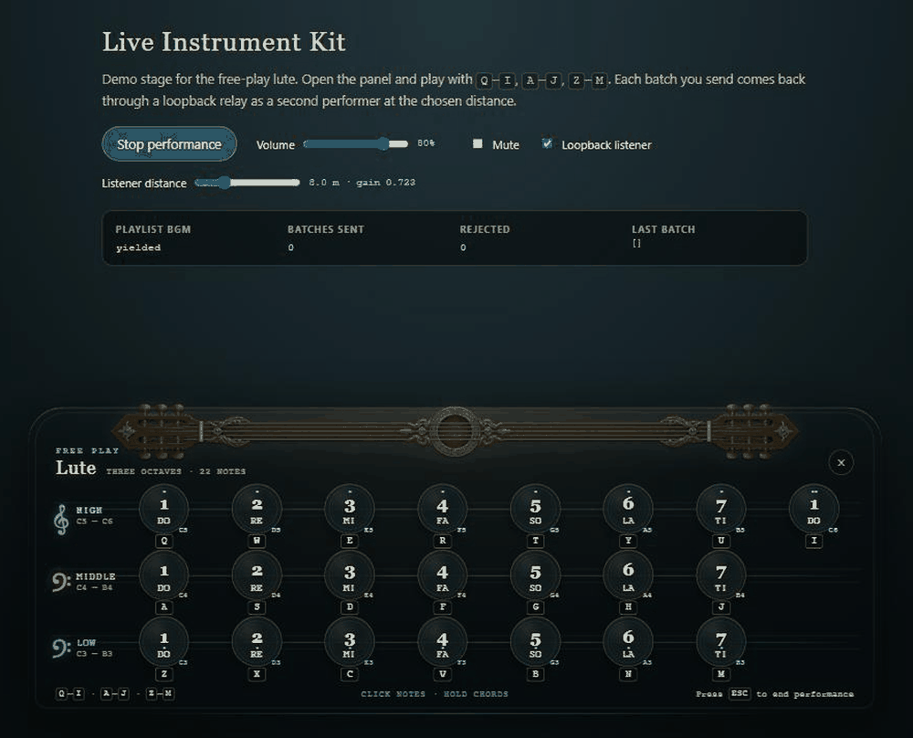
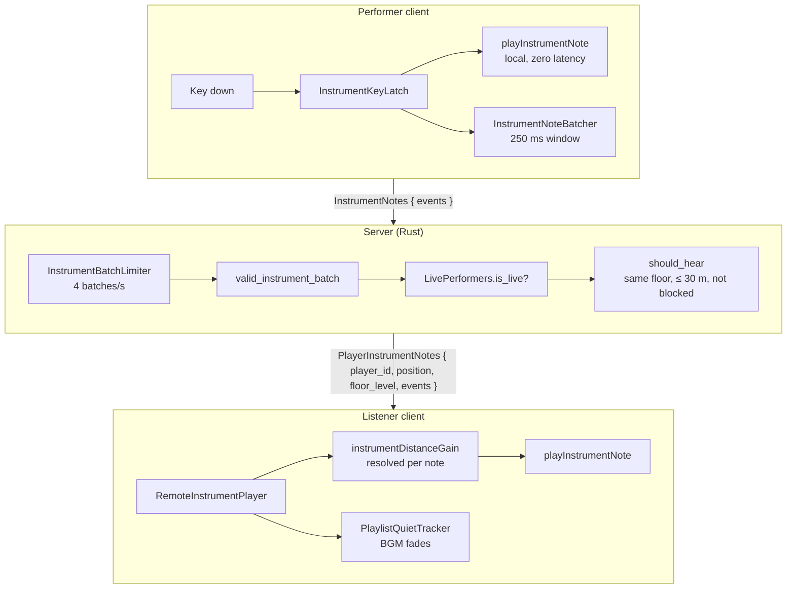

<div align="center">

# Live Instrument Kit

**Play a lute in the browser and let the players around you hear it.**

[](https://github.com/darkdarkcocoa/live-instrument-kit/actions/workflows/ci.yml)
[](#license)
[](packages/core)
[](packages/ui-svelte)
[](packages/server-rust)

**[▶ Live demo](https://darkdarkcocoa.github.io/live-instrument-kit/)** ·
[Integration guide](docs/INTEGRATION.md) ·
[Architecture](docs/ARCHITECTURE.md)



</div>

Live Instrument Kit is a drop-in performance system for multiplayer games. A
player opens a 22-note keyboard HUD and plays; the notes are batched, checked
by the server and replayed for everyone nearby with distance falloff, while the
background music steps aside. The reference skin is a lute; the note table,
synth and UI copy are the only lute-specific parts.

## Why this kit

- **No samples to ship.** Every note is a Karplus–Strong plucked string
  rendered on first use and cached. The whole instrument is a few kilobytes of
  code.
- **Zero latency for the performer, rhythm kept for the audience.** Local
  notes play on key-down. Remote listeners get the batch one network hop
  later with the original timing preserved by per-note offsets.
- **The server has the final say.** A per-connection token bucket, a batch
  rule (≤ 16 notes, 250 ms window, ordered offsets) and a performer registry
  keep floods and forged batches off the wire.
- **Sounds like it is in the world.** Gain is resolved per note from the
  performer's snapshotted position, so a listener walking away hears the tail
  of a phrase fade.
- **Background music yields.** A quiet tracker holds the playlist down while
  the panel is open or notes are heard, and releases it 10 s after the last
  one.
- **One file for the numbers both sides must agree on.** The batch window,
  note cap, radius and rate limit live in `limits.json`; the Rust crate's tests
  assert its constants against it, so a change on one side fails the other
  side's build.

## How it works



The client half never waits for the server; the server half never trusts the
client. [docs/ARCHITECTURE.md](docs/ARCHITECTURE.md) has the numbers behind
each box.

## Packages

| Package                                            | Stack                      | What it holds                                                                                 |
| -------------------------------------------------- | -------------------------- | --------------------------------------------------------------------------------------------- |
| [`@live-instrument/core`](packages/core)           | TypeScript, framework-free | Note table, synth and voice pool, key latch and batcher, wire types, remote replay, BGM yield |
| [`@live-instrument/ui-svelte`](packages/ui-svelte) | Svelte 5                   | `InstrumentPanel` HUD driven by props, plus an optional visibility store                      |
| [`live-instrument`](packages/server-rust)          | Rust crate                 | Wire types, batch validation, token bucket, performer registry, listener hearing rule         |
| [`examples/demo`](examples/demo)                   | Vite + Svelte              | Loopback stage: validates each batch and replays it as a nearby performer                     |

Each half can be adopted on its own. A host without a Rust server can port
the three rules from `core`, where the batch check is mirrored as
`isValidInstrumentBatch`.

## Try it locally

```bash
npm install
npm run dev        # http://localhost:5178
```

Click **Play instrument**, then play with `Q`–`I` (high), `A`–`J` (middle) and
`Z`–`M` (low). Every 250 ms batch is validated, delayed like a network hop and
replayed as a second performer at the distance you pick, so you hear what a
nearby player would.

## Use it in your game

**Mount the panel** and send each finished batch through your transport:

```svelte
<script lang="ts">
  import { InstrumentPanel } from '@live-instrument/ui-svelte'
  import { toWireEvents } from '@live-instrument/core'
  let open = $state(false)
</script>

<InstrumentPanel
  {open}
  performerId={myPlayerId}
  onNotes={(events) =>
    socket.send({ InstrumentNotes: { events: toWireEvents(events) } })}
  onStop={() => {
    socket.send('StopInteraction')
    open = false
  }}
/>
```

**Replay other performers** with gain resolved from where they were:

```ts
import {
  RemoteInstrumentPlayer,
  instrumentDistanceGain,
  PlaylistQuietTracker,
} from '@live-instrument/core'

const remote = new RemoteInstrumentPlayer()
const quiet = new PlaylistQuietTracker({
  onEnter: () => bgm.fadeOut(),
  onLeave: () => bgm.resume(),
})

function onPlayerInstrumentNotes(msg) {
  remote.play(
    msg.player_id,
    msg.events,
    () =>
      msg.floor_level === myFloor()
        ? instrumentDistanceGain(distanceTo(msg.position))
        : 0,
    () => quiet.hold('heard')
  )
}
```

**Validate on the server** before relaying to whoever should hear it:

```rust
use live_instrument::{valid_instrument_batch, should_hear, InstrumentBatchLimiter, LivePerformers};

if limiter.allow() && valid_instrument_batch(&events) && performers.is_live(&player_id) {
    let listeners = players.iter().filter(|l| {
        should_hear(&l.id, &player_id, l.floor == floor, l.distance_to(position), l.blocks(&player_id))
    });
    // encode once, send PlayerInstrumentNotes { player_id, position, floor_level, events } to each
}
```

The full walkthrough, including the start handshake, what ends a performance
and the lock discipline around the registry, is in
[docs/INTEGRATION.md](docs/INTEGRATION.md).

## What the kit decides, and what the host decides

| Kit                                                         | Host                                                     |
| ----------------------------------------------------------- | -------------------------------------------------------- |
| Note table (C3–C6 naturals, A4 = 440 Hz), key map           | Who may perform (item, class, zone)                      |
| Synth voice, 4-voice pool, distance curve                   | Player positions, floors, world wrap                     |
| 250 ms batching, 16-note cap, offset rules                  | Transport (WebSocket, ENet, …) and message envelope      |
| Batch validation and 4/s token bucket                       | Relay to listeners, block lists, area of interest        |
| Remote replay with per-note gain resolution                 | What ends a performance (move, hit, trade, equip, death) |
| Playlist-quiet tracker (panel open, heard notes, 10 s hold) | The BGM player that fades out and back                   |
| Panel UI, keyboard capture, Escape to stop                  | Overlay stacking, camera lock, pose/emote animation      |

## Verify

```bash
npm run verify     # prettier · svelte-check · vitest · cargo test
```

## License

Licensed under either of

- Apache License, Version 2.0 ([LICENSE-APACHE](LICENSE-APACHE) or
  <http://www.apache.org/licenses/LICENSE-2.0>)
- MIT license ([LICENSE-MIT](LICENSE-MIT) or
  <http://opensource.org/licenses/MIT>)

at your option.

Unless you explicitly state otherwise, any contribution intentionally
submitted for inclusion in the work by you, as defined in the Apache-2.0
license, shall be dual licensed as above, without any additional terms or
conditions.

## Assets

The synth is procedural; the kit ships no third-party sound. The only binary
asset is the ornament behind the panel header, recorded in
[docs/ASSETS.md](docs/ASSETS.md).
